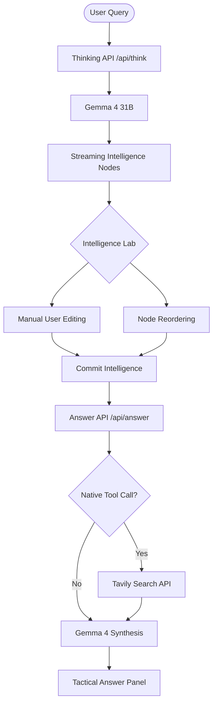
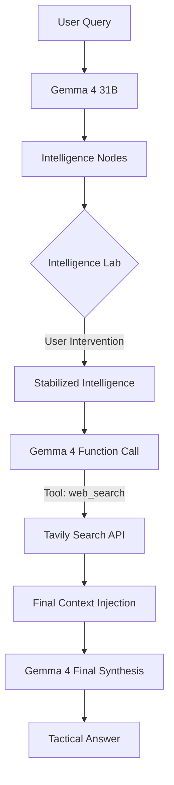

# 🌌 Dead Star

> **"Intercepted intelligence streams from the edge of reasoning."**

Dead Star is a tactical intelligence interface built for the **Build with Gemma 4 Challenge**. It leverages the raw, multi-step reasoning capabilities of the Gemma 4 family to provide "Intercepted Intelligence"—a unique UX where users can see, edit, and collapse AI reasoning nodes before generating a final answer.

---

## 🛰️ The Concept: Intelligence Lab
Most AI interfaces hide reasoning. **Dead Star** puts it center stage.
1. **Intercept**: The system streams multi-node reasoning (Gemma 4).
2. **Intervene**: You can delete, edit, or reorder these "Intelligence Nodes."
3. **Collapse**: You commit the stabilized intelligence to generate the final, tactical answer.

---

## 🏗️ Architecture: The Reasoning Intercept Protocol (RIP)



---

## ⚡ Technical Highlights

- **Gemma 4 Native Function Calling**: Uses the latest Gemma 4 tool-use capabilities to trigger real-time web searches via Tavily only when necessary.
- **Robust Failover Chain**: Implements a multi-layered fallback system (`31B` -> `26B` -> `4B`) with API key rotation to ensure 100% availability during high traffic.
- **Haptic UI/UX**: Built with Framer Motion for a "glassmorphism" tactical feel, featuring instant collapse animations and "Intelligence Depth" token tracking.
- **Context-Aware Reasoning**: Specifically tuned for deep analysis, deconstruction, and modular reconstruction tasks.

---

## 🛠️ Installation & Deployment

### 🚀 One-Command Deploy (Vercel)
The fastest way to experience Dead Star is to click the button below. It will clone the repo and prompt you for your `GEMMA_API_KEY` and `TAVILY_API_KEY`.

[](https://vercel.com/new/clone?repository-url=https%3A%2F%2Fgithub.com%2Fyour-username%2Fdead-star&env=GEMMA_API_KEY,TAVILY_API_KEY)

### 💻 Local Development
1. **Clone & Install**:
   ```bash
   git clone https://github.com/your-username/dead-star.git
   cd dead-star
   npm install
   ```

2. **Environment Variables**:
   Create a `.env.local` file:
   ```env
   # Supports comma-separated keys for automatic rotation
   GEMMA_API_KEY=your_key_1,your_key_2
   TAVILY_API_KEY=your_tavily_key
   ```

3. **Launch**:
   ```bash
   npm run dev
   ```

---

## 🛰️ Architecture: Reasoning Intercept Protocol (RIP)

Dead Star utilizes a unique dual-pass architecture to maximize Gemma 4's reasoning:

1. **The Intercept Pass**: Gemma 4 generates raw reasoning nodes.
2. **The Manipulation Phase**: The user interacts with the Intelligence Lab to prune or refine thoughts.
3. **The Synthesis Pass**: Gemma 4 receives the user-stabilized intelligence AND a native function call result (if needed) to produce the final tactical response.



---

## 🏆 Dev.to Gemma 4 Challenge
This project is an entry for the **Build with Gemma 4** challenge.
Built by Ashan in Pakistan, 2026.
