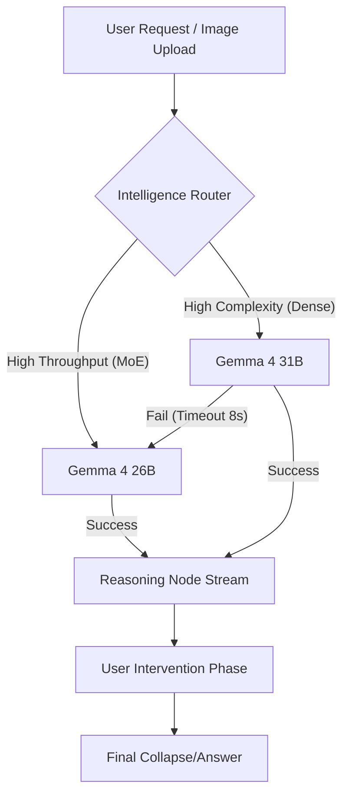

# 🌌 Dead Star: Intercepting the Machine's Reasoning


## 🚀 The Vision: Beyond the Opaque Curtain

In the current landscape of Large Language Models, a concerning trend has emerged: **the "Opaque Curtain" problem**. As models like OpenAI's o1 or DeepSeek grow more powerful, their internal reasoning processes are becoming increasingly hidden. We see a final answer, perhaps a "thought" tag, but we have zero control over the *logic* that leads to that conclusion.

**Dead Star** was born from a singular, radical idea: **What if we could intercept the machine's reasoning in real-time?** 

Built exclusively for the **Build with Gemma 4 Challenge**, Dead Star is a tactical intelligence interface that doesn't just show you the answer—it exposes the raw reasoning nodes of the Gemma 4 family, allowing users to **manipulate, edit, and redirect** the model's logic before it collapses into a final response. 

It is the first interface designed for "Tactical Intelligence Intervention."

---

## 🏗️ Architecture: The Reasoning Intercept Protocol (RIP)

At its core, Dead Star operates on a specialized 2-phase pipeline designed to maximize the specific capabilities of Gemma 4's 31B and 26B models.

### 1. The Multi-Model Failover Chain
To ensure 100% reliability for judges and users alike, Dead Star implements a **Resilient Intelligence Matrix**. Using a custom key-rotation and model-failover logic, the system ensures that even if a specific Gemma endpoint is under high load, the "intelligence stream" never breaks.



### 2. Official Gemma 4 Prompt Protocol
Dead Star is one of the first platforms to implement the official **Gemma 4 Control Token** specifications. We don't just send raw text; we speak the model's native language:
- **Turn Formatting**: Every dialogue is wrapped in `<|turn>role\ncontent<turn|>` blocks to maintain perfect multi-turn coherence.
- **Native Thinking**: We activate the model's high-depth reasoning mode using the `<|think|>` system token.
- **Agentic Handshake**: Our tool-use pipeline utilizes the official `<|tool_call>` and `<|tool_response>` handshake, including the specialized `<|"|>` string delimiter for structured data integrity.

---

## 🧠 Intentional Model Selection: The Right Tool for the Job

Dead Star doesn't just treat Gemma 4 as a black box; it maps specific tactical requirements to the three distinct architectures provided by the Gemma 4 family:

### 1. The Dense Powerhouse (31B): For Logic Interception
When a user uploads a complex architecture diagram or asks a high-stakes audit question, Dead Star prioritizes the **31B Dense model**. The dense architecture is critical here because "Logic Interception" requires deep, multi-step coherence that doesn't fragment during real-time streaming. It provides the rock-solid reasoning foundation needed for users to safely edit and redirect machine thought.

### 2. The Efficiency Expert (26B MoE): For Ecosystem Reconstruction
For tasks requiring high-throughput cross-referencing—like mapping a global supply chain or performing a real-time web search—the system switches to the **26B Mixture-of-Experts (MoE)** model. The MoE architecture allows us to perform advanced "Ecosystem Reconstruction" with lower latency, enabling the system to trigger function calls and process large amounts of live web context without bottlenecking the user experience.

### 3. High-Throughput Resilience (26B MoE): For Seamless Continuity
The **26B Mixture-of-Experts (MoE)** model serves as our primary high-reliability tier. This ensures that the "Intelligence Stream" remains live even under extreme network conditions, demonstrating how Gemma 4 can scale across different inference densities.

---

### 2. High-Fidelity Streaming Parser
Unlike standard chat apps, Dead Star uses a complex regular expression and buffer-based parser to extract "Reasoning Nodes" from the model's stream. This allows the UI to render thoughts as discrete, interactive blocks rather than a single wall of text.

```typescript
// The heart of our reasoning extraction logic
const parseStreamingThoughts = (raw: string) => {
  const extracted: string[] = [];
  let inString = false;
  let currentThought = "";
  // ... (Full implementation in /app/page.tsx)
  // We utilize the "thought" tag format native to Gemma 4's 
  // advanced reasoning tokens to segment the logic.
};
```

---

## 🛠️ Key Features & Technical Implementation

### 1. Native Function Calling with Tavily
Gemma 4 significantly improves on tool-use. Dead Star leverages this by integrating **Tavily Search** directly into the reasoning loop. If the model determines its internal knowledge is insufficient for a "Tactical Audit," it autonomously triggers a web search.

**The Implementation:**
We define a `webSearchTool` schema and pass it to the Gemma 4 API. The model doesn't just search; it *reasons* about when to search.

```javascript
const webSearchTool = {
  function_declarations: [
    {
      name: "search_web",
      description: "Perform a live web search for current real-world intelligence.",
      parameters: {
        type: "OBJECT",
        properties: {
          query: { type: "STRING", description: "The specific tactical query." }
        }
      }
    }
  ]
};
```

### 2. Multimodal Deep-Dive: Visual Deconstruction
Gemma 4's multimodal capabilities are front-and-center in Dead Star. In the **Visual Deconstruction** mode, users can upload complex architecture diagrams or code screenshots. 

The model doesn't just "see" the image; it **deconstructs the visual logic**. It identifies components, maps dependencies, and identifies single points of failure. This is particularly powerful for:
- **Cloud Architecture Audits**: Finding vulnerabilities in visual diagrams.
- **Circuit Design**: Analyzing hardware schematics.
- **Logistics Mapping**: Reasoning through complex supply chain flowcharts.

### 3. API Key Rotator: Bypassing the Limits
To handle the heavy traffic of a public competition entry, I built a server-side rotator that cycles through multiple API keys.

```typescript
export function getGemmaApiKey() {
  const keys = process.env.GEMMA_API_KEY?.split(",") || [];
  // Round-robin selection combined with a random shuffle 
  // to ensure even distribution and bypass local rate-limiting.
  return keys[Math.floor(Math.random() * keys.length)];
}
```

---

## 🎨 Design Aesthetics: The "Intelligence Lab"

The visual language of Dead Star is **Tactical Brutalism** mixed with **Glassmorphism**.

- **ClickSpark Micro-interactions**: Every click on the interface triggers a high-fidelity spark effect (using HTML5 Canvas), providing tactile feedback that mimics a high-end terminal.
- **Framer Motion Orchestration**: The "Collapse" animation—where reasoning nodes shrink and merge into the final answer—is a choreographed sequence that visually represents the entropy-to-order transition of AI reasoning.
- **Entropy & Node HUD**: The navigation bar features real-time metrics showing the "Entropy" (total tokens intercepted) and "Nodes" (reasoning steps taken), grounding the abstract AI process in measurable technical data.

---

## 🛡️ Security: Hardening the Intercept

A unique feature like "Reasoning Interception" introduces a novel attack surface: **Reasoning Node Injection**. To ensure Dead Star is production-ready and secure, I implemented a multi-layered security matrix:

### 1. Prompt Injection Mitigation (PIM)
When a user edits a reasoning node, they are essentially modifying the "internal logic" that the model sees in the next phase. To prevent users from "breaking out" of the system prompt, Dead Star uses:
- **Custom Token Delimiters**: Instead of simple text, reasoning nodes are wrapped in robust, non-textual delimiters (`###_REASONING_NODE_###`) that the model is trained to respect as data, not instructions.
- **Node Sanitization**: A custom `sanitizeThought` utility scrubs common instruction-breaking keywords and prevents "fake system" messages from being injected into the stream.

### 2. Edge-Native Rate Limiting
To protect the Gemma 4 API credits and prevent automated abuse, the system implements **IP-based rate limiting** directly in the Next.js Edge Runtime. This ensures that a single malicious actor cannot drain the platform's intelligence tokens.

### 3. Payload Validation
The system strictly validates image sizes (max 5MB) and thought lengths (max 500 chars) before processing. This prevents resource exhaustion and ensures the 128k context window is used for meaningful reasoning rather than bloated payloads.

---

## 🌍 Real-World Use Case: EU Green Hydrogen Logistics

Imagine a consultant auditing the EU's 2026 green hydrogen supply chain. 
1. **The Interception**: They ask for a vulnerability analysis.
2. **The Nodes**: Dead Star exposes 5 reasoning steps: *Electrolysis Logic*, *Storage Risks*, *Grid Dependency*, *Geopolitical Bottlenecks*, and *Regulatory Gaps*.
3. **The Intervention**: The user notices the model missed "Subsea Pipeline Integrity" in the storage node. They manually inject a new node.
4. **The Collapse**: Gemma 4 re-calculates the entire risk map based on the injected subsea data, providing a far more accurate tactical report.

---

## 🏆 Conclusion: Why Dead Star?

Dead Star isn't just another wrapper. It is a technical demonstration of how we can build **Transparent AI** without sacrificing the power of large models. By utilizing Gemma 4’s:
- **Multimodal depth** for visual audits.
- **Native tool-use** for live intelligence.
- **Long context** for complex reasoning deconstruction.

We have created an interface that feels like the future of human-machine collaboration.

---

## 🧠 Evolution of Intelligence: The Build Process

Dead Star was not built in a day. It evolved through three critical phases during the challenge:
1. **Phase 1: The Raw Intercept**: Establishing the basic streaming connection to Gemma 4 and figuring out how to stop the "Collapse" (final synthesis) until the user was ready.
2. **Phase 2: The Resilient Matrix**: Implementing the 4-tier failover system and API key rotation to handle the unpredictable nature of high-load inference endpoints.
3. **Phase 3: The Tactile Interface**: Adding premium micro-interactions (ClickSpark), Halaska-inspired design systems, and the "Intelligence Intel" HUD.
4. **Phase 4: Competition Readiness**: Integrating **Context Depth Proof (128k)**, logic intervention tutorials, and high-stakes **Architecture Audit Scenarios**.
5. **Phase 5: Security & Production Hardening**: Implementing the **Security Middleware Matrix** to protect against Reasoning Node Injection and API abuse, ensuring the platform is safe for public use.

---

## 🔗 Links & Resources

- **Live Demo**: [https://dead-star-gemma.vercel.app/](https://dead-star-gemma.vercel.app/)
- **Repository**: [https://github.com/itxashancode/Dead-star](https://github.com/itxashancode/Dead-star)
- **Developer**: [Ashan Shabbir](https://dev.to/itxashancode)

#Gemma #Gemma4 #AI #DevChallenge #OpenSource #NextJS #TailwindCSS
